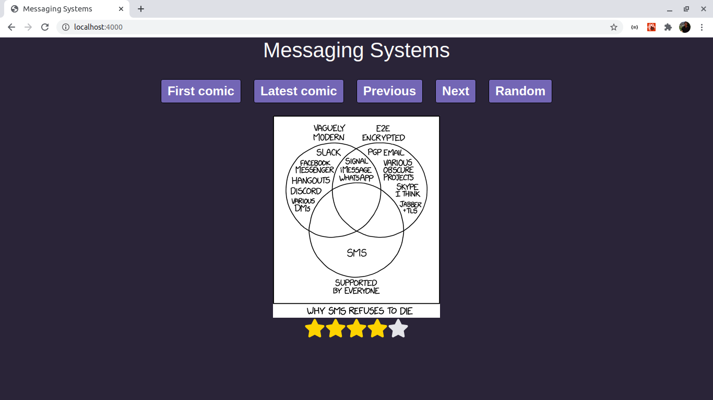

# Comic Viewer

Comic Viewer is a solution made with Webpack, Babel, React.

## Usage

Use npm.

```bash
npm run build # mode production
# The output files are save in dist
npm start # mode development
# The app will be run in: http://localhost:4000/
``` 

## Screenshot




## Contributing
Pull requests are welcome. For major changes, please open an issue first to discuss what you would like to change.


## License
[MIT](https://choosealicense.com/licenses/mit/)
